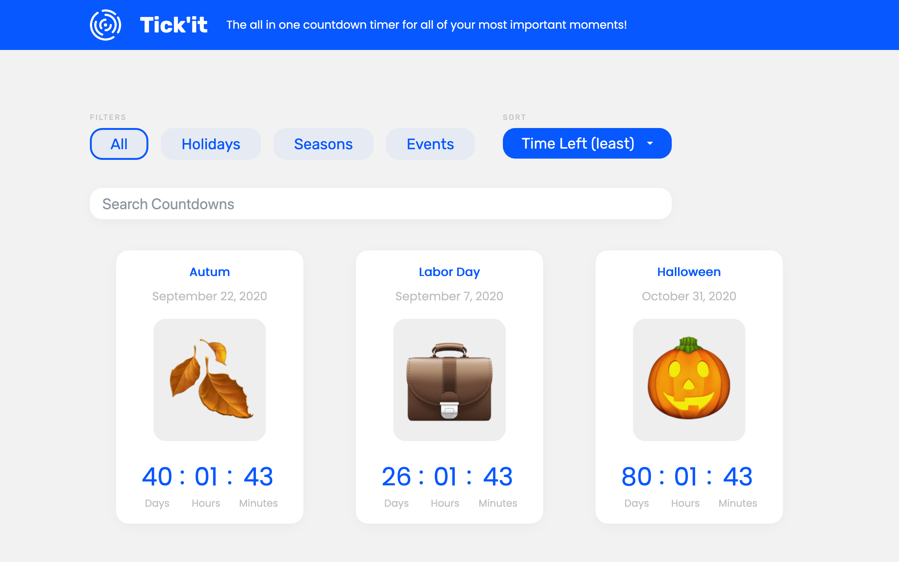

# Tick'it: Countdown timers


## 👀 Overview
⏱ Tick'it is a single page application that allows users to view an array a countdown timers. These timer ranger from US holidays to seasons. 

The purpose of creating this project was to learn more about the front-end framework, Vue. I learned about lifecycle hooks, components, props, the event bus and much more. I am happy with how this project turned out, but I am also looking forward to adding some new functionality once I learn more about Vue!

## 🦾 Features
- Ability to sort and filter events by alphabet, least/ most time left and through search
- Modern UI

## 🖥 Technology Stack
- Vue (ES6, HTML5, SCSS)

## 🚧 Future Updates
- Add users to input their own events
- Add transitions on cards as they are filtered/ sorted
- Add a dark theme
- Add more accessibility features for the sort functionality

## Project setup
```
npm install
```

### Compiles and hot-reloads for development
```
npm run serve
```

### Compiles and minifies for production
```
npm run build
```

### Lints and fixes files
```
npm run lint
```

### Customize configuration
See [Configuration Reference](https://cli.vuejs.org/config/).
